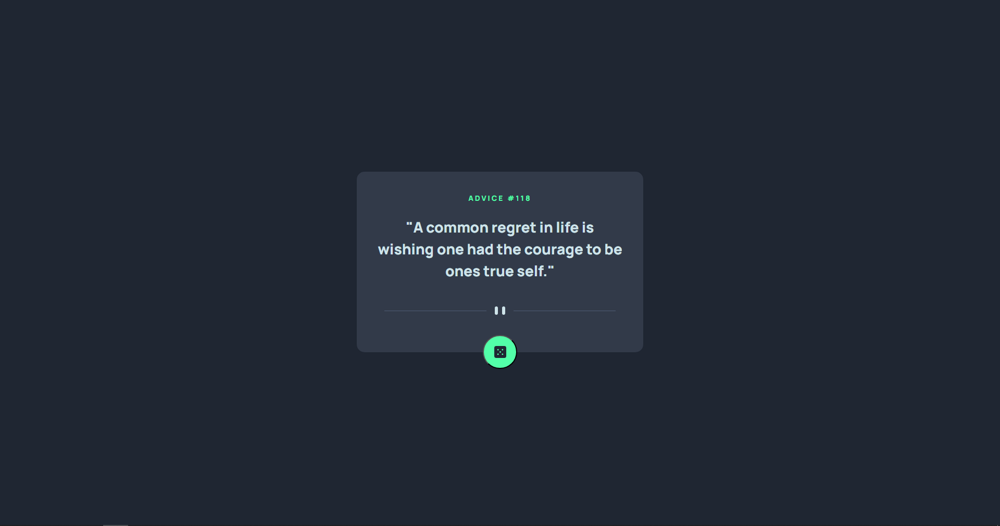
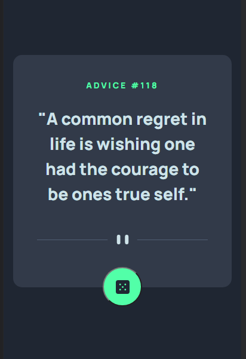

# Frontend Mentor - Advice generator app solution

### Screenshot

<h2>Desktop<h2>

  

<h2>Mobile<h2>

### Links

- Solution URL: [Github](https://github.com/CodeChd/Frontend_Designs/tree/Advice-generator-app)
- Live Site URL: [Netlify](advice-gen-apph.netlify.app)

## My process

### Built with

- Semantic HTML5 markup
- CSS custom properties
- Flexbox
- CSS Grid
- Axios
- [React](https://reactjs.org/) - JS library
