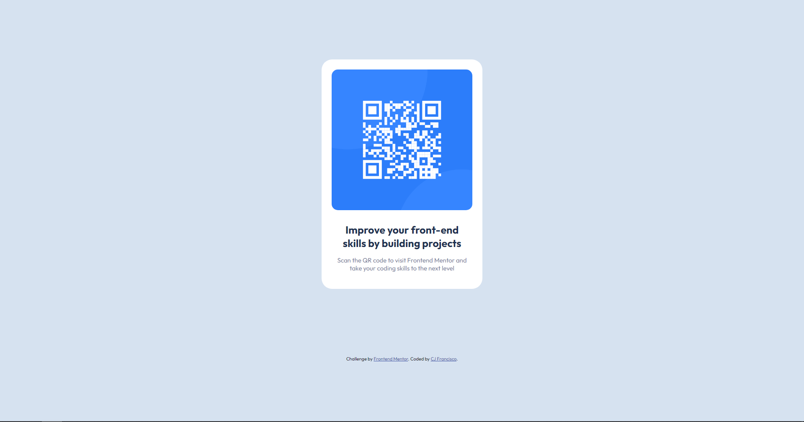

# Frontend Mentor - QR code component solution

### Screenshot
<h1>Desktop View</h1>

  

<h1>Mobile View</h1>

## My process

### Built with

- Semantic HTML5 markup
- CSS custom properties
- Flexbox
- CSS Grid

### What I learned

 I am still in the process of learning how to make elements responsive across all screen sizes. This involves using techniques such as media queries and adjusting CSS properties based on the size of the viewport.

Additionally, I am also learning how to efficiently use inheritance of parent elements in my code. By defining common styles in a parent element, I can reduce the amount of repetitive code and make my CSS files easier to maintain.

Both of these skills are crucial for creating modern and user-friendly websites, and I am committed to continuing to improve my understanding and implementation of them.

